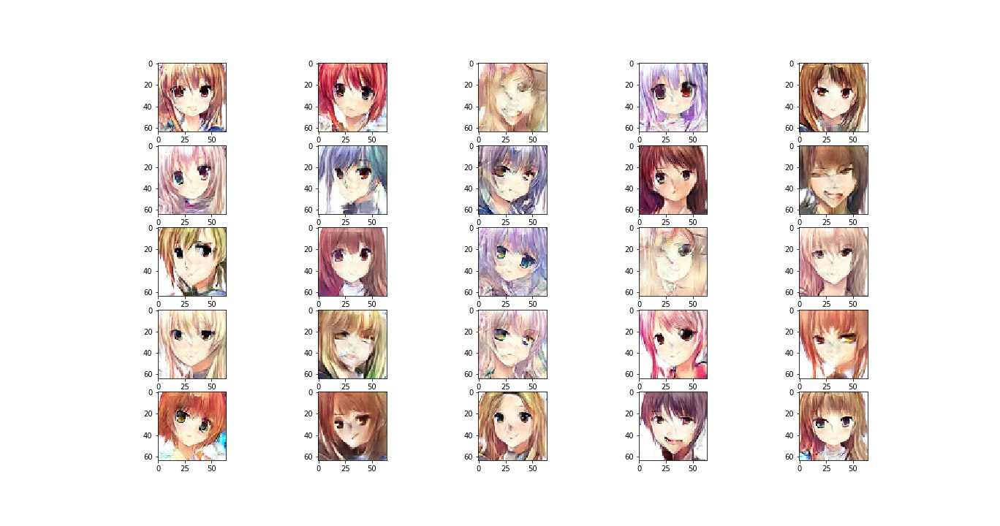
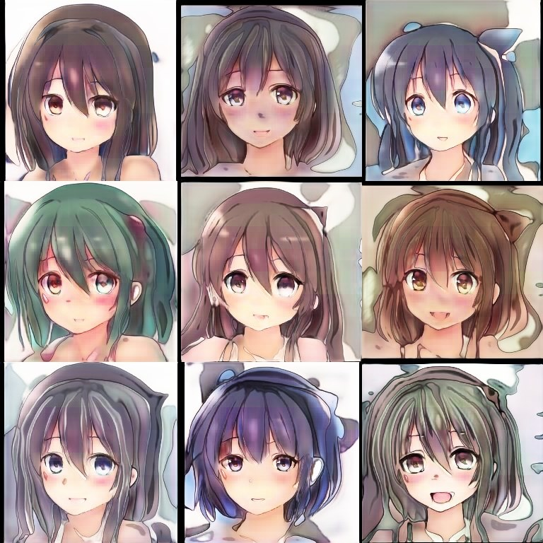

# AnimeGAN-Keras
A Collection of my reimplemented GAN architectures which are my most favorite machine learning models.

1. Vanila GAN
2. Wasserstein GAN with Gradient Penalty
3. StyleGAN without progressive training

## Datasets

Those GAN models were trained using soumik12345's dataset and Danbooru dataset processed by GWERN

soumik12345's dataset: https://www.kaggle.com/soumikrakshit/anime-faces
Danbooru dataset from GWERN: https://www.gwern.net/TWDNE

## Samples from soumik12345's dataset

## Generated samples from DCGAN

## Generated samples from StyleGAN

Btw, I also like other GAN but not yet know how to implement xD
